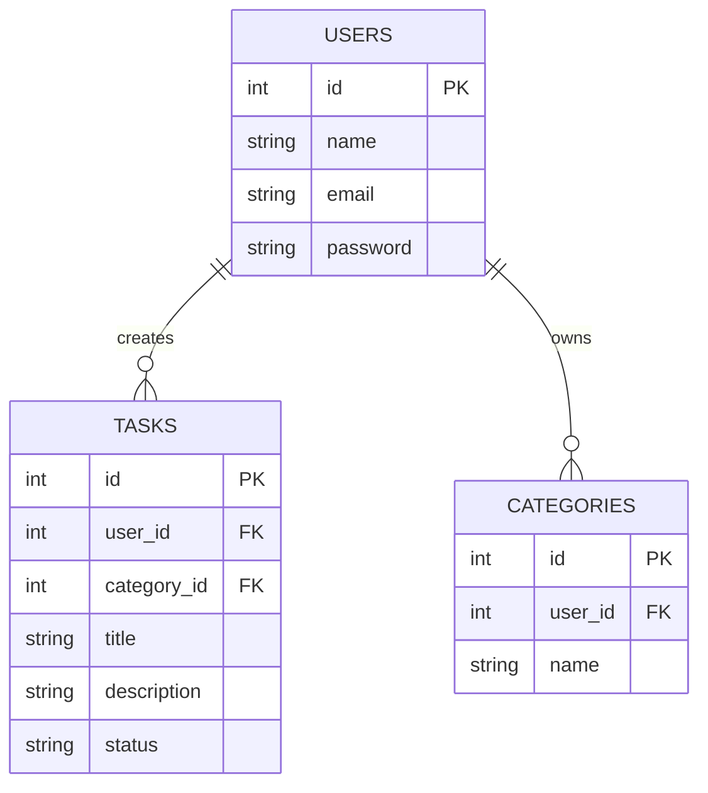

# TaskManager ER Diagram

```mermaid
erDiagram
    USERS ||--o{ TASKS : creates
    USERS ||--o{ CATEGORIES : owns

    USERS {
        int id PK
        string name
        string email
        string password
    }

    TASKS {
        int id PK
        int user_id FK
        int category_id FK
        string title
        string description
        string status
    }

    CATEGORIES {
        int id PK
        int user_id FK
        string name
    }
```
